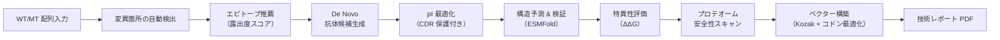
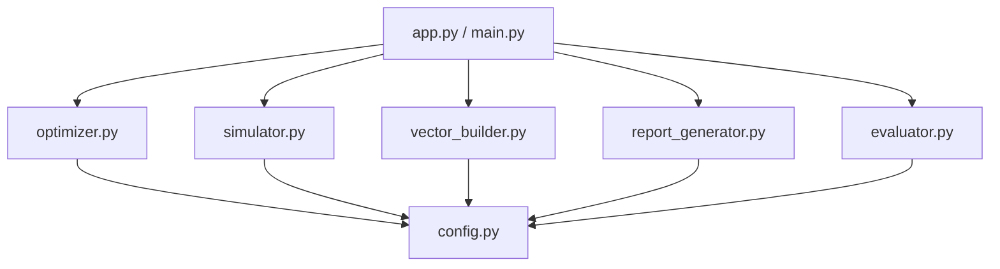

# 🧬 Intrabody Design Platform

[](https://www.python.org/)
[](https://streamlit.io/)
[](https://opensource.org/licenses/MIT)
[](https://biopython.org/)

**細胞内抗体（イントラボディ）のデザインからベクター構築、結合シミュレーションまでを自動化する統合パイプライン**

変異型タンパク質に選択的に結合するイントラボディを *in silico* で設計し、エピトープ推薦 → pI 最適化 → 特異性評価 → プロテオーム安全性スキャン → レンチウイルスベクター構築 → 技術レポート生成までをワンストップで実行できます。

---

## 🔬 科学的背景

イントラボディは **細胞内で機能する抗体** であり、通常の抗体とは異なる設計上の課題があります。

| 課題 | 原因 | 本ツールの対応 |
|:---|:---|:---|
| 細胞内での凝集 | 還元環境でジスルフィド結合が不安定化 | pI を 8.5–9.5 に調整し、電荷反発で可溶性を維持 |
| 変異型への選択性 | WT/MT 間の構造差が微小 | ΔΔG ベースの特異性スコアリングで定量評価 |
| オフターゲット結合 | ヒトプロテオームとの交差反応性 | 配列相同性スキャンによる安全性評価 |
| ベクター構築の手間 | コドン最適化・Kozak 付加等の定型作業 | GenBank 形式での自動生成（EF1a / CMV プロモーター選択可） |

---

## 🏗 パイプライン概要



---

## ✨ 主な機能

### エピトープ推薦 & 抗体候補生成
Kyte-Doolittle 疎水性スケールの逆数を露出度スコアとして算出し、ターゲットタンパク質表面の高露出ドメインを自動推薦します。スライディングウィンドウ方式で全長を走査し、上位候補を提示します。

### pI 最適化エンジン（CDR 保護付き）
フレームワーク領域（FR）のみを置換対象とし、CDR（抗原結合部位）を保護しながら等電点を目標範囲に調整します。pI を上げる方向（疎水性残基 → K/R/H）と下げる方向（R/K → Q/N）の双方向に対応し、置換候補を3段階で試行します。

### 候補配列のバッチ評価
複数の候補配列を GRAVY（疎水性指標）と pI の2軸で評価し、総合スコアでランキングします。凝集リスクの低い可溶性の高い候補を効率的に選別できます。

### 結合特異性評価
野生型 vs 変異型に対する結合自由エネルギー差（ΔΔG）をスコアリングし、変異型への選択的結合を定量的に評価します。

### ヒトプロテオーム安全性スキャン
抗体候補がヒトの正常タンパク質に非特異的結合しないかを、配列相同性ベースで評価します。

### レンチウイルスベクター自動構築
ヒト最適化コドン変換 → Kozak 配列付加 → プロモーター（EF1a / CMV）結合 → GenBank 形式出力を自動実行します。dna-features-viewer によるベクターマップ可視化にも対応しています。

### PDF 技術レポート生成
解析結果を、配列情報・ベクターマップ・物性評価・安全性評価・判定基準を含む再現可能な技術レポートとして PDF 出力します。

---

## 📁 プロジェクト構成

```
intrabody-design-platform/
├── app.py                      # Streamlit Web UI
├── main.py                     # CLI パイプライン（argparse 対応）
├── src/
│   ├── __init__.py
│   ├── config.py               # 定数・閾値の一元管理（30+ 項目）
│   ├── optimizer.py            # pI 最適化エンジン（CDR 保護付き）
│   ├── evaluator.py            # 候補配列のバッチ評価・ランキング
│   ├── simulator.py            # 結合シミュレーション・特異性評価（6 クラス）
│   ├── vector_builder.py       # GenBank ベクター構築
│   └── report_generator.py     # PDF 技術レポート生成
├── data/
│   └── example_sequences/      # サンプル入力配列（KRAS WT / G12D）
├── results/                    # 出力ファイル（自動生成）
├── requirements.txt
├── .gitignore
└── LICENSE
```

### モジュール依存関係



全モジュールが `config.py` を参照する構成とし、閾値変更は1箇所で完結します。

---

## 🚀 セットアップ

### 前提条件

- Python 3.9 以上
- pip

### インストール

```bash
git clone https://github.com/TSUBAKI0531/intrabody-design-platform.git
cd intrabody-design-platform
pip install -r requirements.txt
```

---

## 🛠 使い方

### Web UI（Streamlit）

```bash
streamlit run app.py
```

ブラウザで `http://localhost:8501` が開きます。WT/MT 配列を入力し、「パイプラインを実行」で全ステップを自動実行できます。

**UI の主な機能:**
- 変異箇所の自動検出と可視化
- ドメイン露出度スコアのリアルタイム表示
- Alanine Scanning 結果のインタラクティブ棒グラフ（Plotly）
- Kyte-Doolittle 疎水性プロファイル
- py3Dmol による 3D 構造ビューア
- PDF レポート & PDB ファイルのダウンロード

### CLI モード

```bash
# デフォルト配列（KRAS-G12D）で実行
python main.py

# カスタム配列をファイルで指定
python main.py --wt data/example_sequences/kras_wt.fasta \
               --mt data/example_sequences/kras_g12d.fasta \
               --output results/experiment_01

# ヘルプ
python main.py --help
```

---

## 📊 出力例

| 出力ファイル | 形式 | 内容 |
|:---|:---|:---|
| `Final_Vector.gb` | GenBank | コドン最適化済みレンチウイルスベクター配列（Kozak + CDS + 終止コドン） |
| `Full_Analysis_Report.pdf` | PDF | 配列情報・ベクターマップ・物性評価・安全性評価を含む技術レポート |
| `designed_intrabody.pdb` | PDB | ESMFold 予測による 3D 構造（Web UI からダウンロード） |

---

## ⚙️ 設計判断と今後の展望

本プロジェクトは**段階的開発**の設計方針をとっています。パイプライン全体の統合構造を先に構築し、各ステップの計算エンジンを順次高精度な実装に置き換えられる設計です。

| ステップ | 現在の実装 | 将来の統合先 |
|:---|:---|:---|
| De Novo 抗体生成 | テンプレート配列（プレースホルダー） | ProteinMPNN / RFdiffusion |
| 構造予測 | ESMFold API | AlphaFold2 / ColabFold（ローカル） |
| 特異性評価（ΔΔG） | プレースホルダー値 | FoldX / PRODIGY |
| Alanine Scanning | ランダムシミュレーション | FoldX CalculateMutationEnergy |
| プロテオームスキャン | プレースホルダーデータ | BLAST / HMMER / Foldseek |
| CDR 同定 | Cys 位置ベースの簡易推定 | ANARCI（IMGT 番号付け） |

各プレースホルダーにはコード内に `TODO:` ブロックとして将来の統合方針を明記しています。

---

## 🔧 技術スタック

| カテゴリ | ライブラリ |
|:---|:---|
| バイオインフォマティクス | BioPython, dna-features-viewer |
| 構造可視化 | py3Dmol, stmol |
| データ処理 | pandas, NumPy |
| 可視化 | Plotly, Matplotlib |
| Web UI | Streamlit |
| レポート生成 | FPDF2 |
| 構造予測 API | ESMFold |

---

## 📜 ライセンス

[MIT License](LICENSE)
