# Intrabody Design Platform

細胞内抗体（intrabody）の設計・最適化から発現ベクター構築・技術レポート生成までを in silico で一気通貫実行する統合パイプライン。

> **細胞内抗体（intrabody）専用** — 通常の分泌型抗体ツールでは考慮されない還元環境耐性・細胞内フォールディング安定性を中心に設計されています。scFv・単一ドメイン抗体の細胞内機能化に特化したパイプラインです。

---

## 解決した課題

変異型タンパク質（KRAS-G12D 等）を細胞内で選択的に阻害するためのイントラボディ設計は、通常の抗体設計ツールでは対応できない固有の課題がある。細胞質の還元環境ではジスルフィド結合が不安定化し、通常の抗体はフォールディングを維持できない。また WT/MT 間の構造差は微小なため、単純な結合親和性最適化では選択性が担保されない。

本ツールは以下の課題をワンパイプラインで解決する。

| 課題 | 原因 | 本ツールの対応 |
|:---|:---|:---|
| 細胞内での凝集 | 還元環境でジスルフィド結合が不安定化 | pI を 8.5–9.5 に調整し、電荷反発で可溶性を維持 |
| 変異型への選択性 | WT/MT 間の構造差が微小 | ΔΔG ベースの特異性スコアリングで定量評価 |
| オフターゲット結合 | ヒトプロテオームとの交差反応性 | スライディングウインドウ類似度スキャン |
| ベクター構築の手間 | コドン最適化・Kozak 付加等の定型作業 | GenBank 形式での自動生成（EF1a / CMV プロモーター選択可） |

---

## 主要機能

- **エピトープ推薦 & 抗体候補生成** — Kyte-Doolittle スケールの逆数を表面露出度スコアとして算出し、スライディングウィンドウで高露出ドメインを自動推薦。ターゲット荷電特性への相補性に基づく CDR-H3 擬似生成で scFv 候補を構築
- **pI 最適化エンジン（CDR 保護付き）** — Cys 位置ベースの CDR 推定で抗原結合領域を保護しながら、フレームワーク（FR）残基のみを置換。pI を上げる（疎水性残基 → K/R）・下げる（R/K → Q/N）双方向の置換に対応
- **双方向リファインメントループ** — `RefinementEngine` が「配列最適化（FR 置換）→ 構造品質検証（pLDDT / iPAE）」のループを複数の目標 pI で反復し、構造的に妥当な最適化配列を自動選択
- **特異性評価 & プロテオームスキャン** — 変異位置の疎水性変化（ΔKD）と荷電変化を積算した ΔΔG スコアで WT vs MT 選択性を定量化。ヒト代表タンパク質 5 種へのオフターゲットリスクをスライディングウィンドウで評価
- **ベクター構築 & PDF レポート生成** — ヒト最頻コドン変換・Kozak 配列付加・プロモーター結合を自動実行し GenBank 形式で出力。解析結果全体を配列情報・ベクターマップ・物性評価・判定基準を含む技術レポート PDF として出力

---

## 技術スタック

| カテゴリ | 使用技術 |
|:---|:---|
| バイオインフォマティクス | BioPython — ProteinAnalysis（pI・GRAVY・分子量）、SeqIO（GenBank 出力）、Kyte-Doolittle スケール |
| ベクター設計 | dna-features-viewer — GenBank ベクターマップ可視化（PDF 埋め込み） |
| データ処理 | pandas、NumPy、SciPy |
| 可視化 | Plotly（Alanine Scanning インタラクティブ棒グラフ）、Matplotlib（ベクターマップ） |
| 3D 構造ビューア | py3Dmol + `streamlit.components.v1.html()` — Streamlit Cloud 互換の HTML 埋め込み方式 |
| Web UI | Streamlit — session_state によるステート管理 |
| レポート生成 | fpdf2 — PDF 技術レポート自動生成 |
| CLI | argparse — FASTA / テキスト入力対応のバッチ実行 |

---

## アーキテクチャ

```mermaid
flowchart LR
    subgraph INPUT["入力"]
        A["WT / MT\nアミノ酸配列"]
    end

    subgraph PIPELINE["設計パイプライン（src/）"]
        B["AntibodyDiscoveryEngine\nエピトープ推薦\nscFv 候補生成"]
        C["IntrabodyOptimizer\nFR 残基置換\nCDR 保護付き pI 最適化"]
        D["AFMValidator\n構造品質検証\npLDDT / iPAE"]
        E["RefinementEngine\n双方向リファインメントループ\n複数目標 pI で反復"]
        F["SpecificityEvaluator\nΔΔG 特異性スコア\nWT vs Mutant"]
        G["ProteomeScanner\nオフターゲットリスク\nヒトプロテオーム"]
    end

    subgraph OUTPUT["出力"]
        H["VectorDesigner\nGenBank ベクター"]
        I["AnalysisReport\nPDF 技術レポート"]
    end

    A --> B --> C
    C --> D
    D -- "Success" --> E
    D -- "Failed → 次の pI" --> C
    E --> F --> G --> H --> I

    style INPUT fill:#EBF5FB,stroke:#2980B9
    style PIPELINE fill:#EAF9EA,stroke:#27AE60
    style OUTPUT fill:#FEF9E7,stroke:#F39C12
```



### ファイル別役割

| ファイル | 役割 |
|:---|:---|
| `app.py` | Streamlit Web UI、配列入力バリデーション、タブ別結果表示、エクスポート |
| `main.py` | argparse CLI、FASTA 読み込み、パイプライン実行、ログ出力 |
| `src/config.py` | 全定数・閾値を一元管理（pI 範囲、コドンテーブル、Kozak 配列、プロモーター等 30+ 項目） |
| `src/optimizer.py` | `IntrabodyOptimizer` — CDR 保護付き FR 残基置換による pI 最適化エンジン |
| `src/simulator.py` | `AntibodyDiscoveryEngine` / `AFMValidator` / `RefinementEngine` / `MutantSimulator` / `SpecificityEvaluator` / `ProteomeScanner` の 6 クラス |
| `src/evaluator.py` | `BatchEvaluator` — 複数候補の GRAVY × pI 複合スコアによる一括評価・ランキング |
| `src/vector_builder.py` | `VectorDesigner` — ヒト最頻コドン変換・Kozak・プロモーター結合・GenBank 出力 |
| `src/report_generator.py` | `AnalysisReport` — fpdf2 による PDF 技術レポート生成（ベクターマップ埋め込み対応） |

---

## 使用方法

### セットアップ

```bash
git clone https://github.com/TSUBAKI0531/intrabody-design-platform.git
cd intrabody-design-platform
pip install -r requirements.txt
```

### Web UI（Streamlit）

```bash
streamlit run app.py
# → http://localhost:8501
```

WT/MT アミノ酸配列を入力し「パイプラインを実行」ボタンで全ステップが自動実行されます。デフォルト配列として KRAS-WT / KRAS-G12D（G12D 変異：12 番目 Gly → Asp）が入力済みです。

**UI の主な操作フロー:**

1. WT / MT 配列を入力（変異箇所が自動検出・ハイライト表示）
2. エピトープドメイン範囲をスライダーで選択（Exposure Score がリアルタイム表示）
3. 「パイプラインを実行」→ Specificity Score / 最終 pI / ステータスが表示
4. タブで Alanine Scanning 棒グラフ・疎水性プロファイル・3D 構造ビューアを確認
5. PDF レポートまたは PDB ファイルをダウンロード

### CLI モード

```bash
# デフォルト配列（KRAS-G12D）で実行
python main.py

# カスタム FASTA ファイルを指定
python main.py --wt data/example_sequences/kras_wt.fasta \
               --mt data/example_sequences/kras_g12d.fasta \
               --output results/experiment_01

# ヘルプ
python main.py --help
```

### 出力ファイル

| 出力ファイル | 形式 | 内容 |
|:---|:---|:---|
| `results/Final_Vector.gb` | GenBank | コドン最適化済みレンチウイルスベクター（Kozak + CDS + 終止コドン） |
| `results/Full_Analysis_Report.pdf` | PDF | 配列情報・ベクターマップ・物性評価・オフターゲット評価・判定基準 |
| `results/designed_intrabody.pdb` | PDB | ESMFold 予測による 3D 構造（Web UI からダウンロード） |

---

## 設計上の工夫

**双方向リファインメントループ（bidirectional optimization）**
単方向の pI 最適化では「配列が目標 pI に収束しても構造品質が担保されない」という限界がある。`RefinementEngine.run_refinement_loop()` は IntrabodyOptimizer（配列最適化）と AFMValidator（構造評価）を組み合わせ、複数の目標 pI `[8.5, 9.0, 9.5]` で最適化を試みながら構造品質基準（pLDDT ≥ 70, iPAE ≤ 10）をパスした最初の結果を採用する。配列空間の探索と構造的妥当性の検証を同一ループ内で完結させることで、単方向最適化に比べて無駄な候補の生成を抑制している。

**CDR 保護付き pI 最適化**
CDR（相補性決定領域）は抗原結合に直結するため、pI 調整のための置換対象から保護する必要がある。`IntrabodyOptimizer._identify_cdrs()` は Kabat 番号付けの経験則（1番目・最後の Cys 位置から CDR 領域を推定）を実装し、Cys が少ない配列には配列長ベースのフォールバックを提供している。FR 領域の疎水性残基のみを塩基性（K/R）または酸性（D/E）残基に置換することで、抗原結合能を損なわずに pI を調整する。

**Streamlit Cloud 制約への適応（3D ビューア）**
py3Dmol の `view._make_html()` が返す HTML を `streamlit.components.v1.html()` で埋め込む方式を採用している。stmol ライブラリは Streamlit Cloud の依存環境との互換性問題が生じるため、HTML 直接埋め込みへ置き換えた。この解決パターンは GlycoAntibodyStudio-cloud と共通であり、Streamlit Cloud デプロイを前提とした 3D ビューア実装の標準アプローチとなっている。

**全閾値の config.py 一元管理**
pI 許容範囲・コドンテーブル・Kozak 配列・プロモーター配列・特異性評価閾値など 30 以上のパラメータを `src/config.py` に集約している。各モジュールはマジックナンバーを持たず config を参照する構成のため、実験条件の変更やキャリブレーションが 1 ファイルの変更で完結する。

**段階的実装（PoC + 将来統合方針の明示）**
De Novo 抗体生成（現在はテンプレートベース）・ΔΔG 計算（物理化学的近似）・プロテオームスキャン（代表タンパク質 5 種のモック）は PoC 実装であり、コード内に `TODO:` ブロックとして ProteinMPNN / FoldX / BLAST への統合方針を明記している。パイプライン全体の統合構造を先に構築し、各ステップのエンジンを順次高精度な実装に差し替えられる設計になっている。

---

## 今後の拡張可能性

- **深層学習 CDR 生成の統合** — `AntibodyDiscoveryEngine.discover_binder()` のバックエンドを ProteinMPNN / RFdiffusion に接続し、テンプレートベースから学習ベースの CDR-H3 生成へ移行
- **構造予測の高精度化** — `AFMValidator` を AlphaFold2 / ColabFold（ローカル実行）に接続し、ESMFold API 停止後の構造予測精度を回復
- **ΔΔG 計算の実装** — FoldX / PRODIGY による実験値相関ベースの自由エネルギー差計算に置き換え、特異性評価精度を向上
- **ANARCI による正確な CDR 同定** — `_identify_cdrs()` の Cys 位置ベース推定を IMGT 番号付けに対応した ANARCI に置き換え
- **プロテオームスキャンの本格化** — 5 種モックから BLAST / HMMER / Foldseek によるヒトプロテオーム全体検索へ拡張

---

## ライセンス

[MIT License](LICENSE)

---

## Author

GitHub: [@TSUBAKI0531](https://github.com/TSUBAKI0531)
